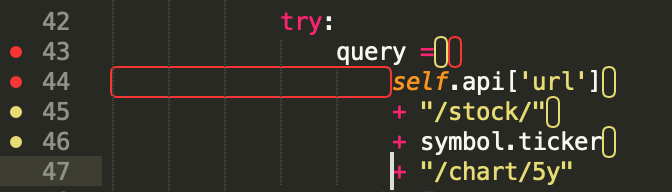
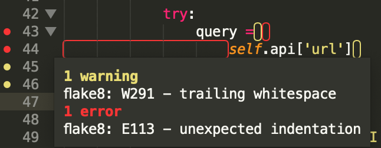

# How to set up a python project and development environment

I've recently started my first python project, and I made the mistake of jumping directly into it. I ignored many of the software engineering principles I've applied to many of my projects in other languages, probably mostly because I wasn't terribly familiar with python and its complementary development processes.

Later on, the project source began to expand rapidly, and it became obvious that my source code was concentrated highly on a small number of source files. This isn't *necessarily* a bad thing, but I felt that it wasn't modular enough, and wasn't well encapsulated. This prompted me to work out how my program should be structured, and subsequently what an appropriate workflow would be if I wanted to release the program as a package.

With this in mind, this article is going to address a few points:

* Structuring your repository for release as a package
* Setting up a python development environment
* Common tools to help with your workflow

I'll address each of these in order. It's important to note that I'm *extremely* new to python development, and there are many (and probably better) ways of doing this. I'm using this blog post to:

1. Define a baseline for myself, as something to start with and build on
2. Provide a discussion about one way to set this up for people new to python

# Packages and Modules in Python

Just to provide some understanding before jumping into more detail, I'll briefly describe two of the organisational tools presented in python to aide modular programming; modules and packages. Python has the ability to provide abstraction and code segregation *through* the use of modules and packages.

A module is a [single python source file](https://realpython.com/python-modules-packages/), i.e. `database.py`. This module should contain functions or classes that are semantically related. To use a database example, the module `database.py` might contain `connect()`, `close()`, `read()` and `write()` functions. This module can then be imported by other modules using the statement `import database` at the beginning of the code. These functions are then accessible using the dot operator `.`, i.e: `database.connect()`. Alternatively, you can import specific functions from a module using the statement `from database import connect`, and then just call `connect()` directly. A more thorough discussion of ways to import modules is available at [Digital Ocean](https://www.digitalocean.com/community/tutorials/how-to-import-modules-in-python-3).

A package is a way of grouping many modules, which is handy as your application grows in size. Specifically, this allows you to group modules into packages by function to avoid naming conflicts, and provide semantic meaning to the modules. The example provided in the [python module documentation](https://docs.python.org/3/tutorial/modules.html) indicates packages should follow a structure similar to the following:

```bash
sound/
├── __init__.py
├── formats/
│   ├── __init__.py
│   ├── wavread.py
│   ├── aiffread.py
│   ├── aiffwrite.py
│   ├── auread.py
│   ├── auwrite.py
│   ├── wavread.py
├── effects/
│   ├── __init__.py
│   ├── echo.py
│   ├── surround.py
│   ├── reverse.py
└── filters/
    ├── __init__.py
    ├── equalizer.py
    ├── vocoder.py

```
You can see that by referencing `sound.effects.echo`, `echo.py` is a sound effect module containing echo related functions or classes. This isn't a *complete* replacement for object orientation, but it certainly provides *some* of the advantages as tools to aid a functional approach.

Each package in this example is identified by the presence of the `__init__.py` file at the package root directory. This means that `sound` is the parent package, with subpackages `formats`, `effects`, and `filters`. Organising a program into one parent package has a number of benefits; first that it allows you to install the package to your host system and run it as a program rather than from the source code directly, and secondly that it allows you to distribute your application as a package through package management tools such as the Python Package Index (PyPI) and `pip` if you so choose.

# Structuring your repository

The first step to getting started with python is creating a project directory. This is the structure I've decided to adopt:

```bash
projectname/
├── src/
│   └──packagename/
│   	├── __init__.py
│   	├── subpackage1/
│   	│   ├── __init__.py
│   	│   ├── subpackage1.py
│   	├── subpackage2/
│   	│   ├── __init__.py
│   	│   ├── subpackage2.py
│   	└── subpackage3/
│       	├── __init__.py
│       	├── subpackage3.py
├── tests/
│   ├── test_subpackage1.py
│   └── test_subpackage2.py
├── docs/
│    └── Makefile
├── .gitignore
├── Makefile
├── Dockerfile
├── requirements.txt
├── dev-requirements.in
├── dev-requirements.txt
├── setup.py
├── LICENSE
└── README.md
```

I'll discuss each of the components of note:

* `src/` holds a top level package encapsulating all of the source code for the project.
* `tests/` is a directory containing the unit and integration tests that you write for your code. I highly suggest adopting a Test Driven Development (TDD) approach to development; I realise it's a bit of a chore to begin with, but it's good practice and it will help you validate your code when you're building more complicated projects. I've adopted [`py.test`](https://docs.pytest.org/en/latest/) as the tool to achieve this, and I've found it very effective so far.
* `docs/` is a directory containing the documentation for the program, and contains a `Makefile` for building the documentation using `sphinx` and cleaning up afterward. If you want to release your program, you can host this documentation for free at [readthedocs.io](https://readthedocs.org/)
* `Makefile` contains commands to automate the installation and upgrade of your project dependencies, and will be discussed in more detail later
* `Dockerfile` contains the docker configuration to create a docker image. This is useful if you're planning on distributing your program as a docker image
* `setup.py` contains the package metadata, and installation configuration including a list of packages required by the program. This allows you to execute `pip install <package>` and install your package as an executable.
* `requirements.txt` is the output of `pip-compile`, providing an enumerated list of *all* packages required by your program. This contains those listed in `setup.py` as well as the packages these depend on.
* `dev-requirements.in` is the file in which you specify the packages required by the program developer
* `dev-requirements.txt` is the development package version of `requriements.txt`. This is where the packages required for project development are installed from, and is also created using `pip-compile`.

Now, some of you who are reading will have spotted the fact that I've used a `src` directory, instead of just having the package directory in the project root. I had considered this, but after reading Ionel Cristian Mărieș' [blog post on the matter](https://blog.ionelmc.ro/2014/05/25/python-packaging/), I was convinced that using a `src` directory has a number of benefits:

1. It prevents readily importing the code in `setup.py`
2. It *forces* me to test installed code, making sure the deployed code will work
3. It mitigates the risk of shipping a package with missing dependencies
4. It stops `setuptools` from putting the project root on `sys.path`, and all the junk in it

There are other benefits, but these were what convinced me to adopt this method. Please have a read of his post if you'd like more detail! Some other articles that helped inform this, and are good reading are:

* [Packaging a python library](https://blog.ionelmc.ro/2014/05/25/python-packaging/)
* [Interesting Things, Largely Python and Twisted Related](http://as.ynchrono.us/2007/12/filesystem-structure-of-python-project_21.html)
* [Python packages and you](http://blog.habnab.it/blog/2013/07/21/python-packages-and-you/)
* [Common packaging pitfalls](https://blog.ionelmc.ro/2014/06/25/python-packaging-pitfalls/)
* [Python Documentation](https://docs.python.org/3/tutorial/modules.html#packages)

Additionally, the layout you choose can vary based on application. Will it be a web application or a simple script? A discussion of alternative layouts is available [here](https://realpython.com/python-application-layouts/#command-line-application-layouts).

The creation of `setup.py`, `requirements.txt` and `dev-requirements.txt` will be discussed in the next section.

# Setting up a python development environment

## Virtual Environments
	
The next step is to set up a virtual environment for development. This is facilitated using the `virtualenv` package. A [virtual environment](https://docs.python.org/3/tutorial/venv.html) is a ***self contained*** directory tree, that contains a Python installation for a particular version of Python, plus a number of additional packages. Different applications can then use different virtual environments. This is important because it allows for the containment of project dependencies. To be explicit with an example of this, lets say you develop project `x` in your host environment, which depends on a specific package version, `pkg 0.15`. Then, you begin development work on project `y` in your host environment, and you want to use a newer version of `pkg`; lets say `pkg 0.25`. If you're installing this all into your global package directory, doing this would mean that project `x` no longer works. The solution to this is to use [`virtualenv`](https://docs.python-guide.org/dev/virtualenvs/). This allows all of these packages to be installed in self contained virtual environments to avoid global conflicts. This can be achieved as follows:

	$ pip install virtualenv
    $ cd my_project_folder
	$ virtualenv venv

This will install `virtualenv` to your host environment, and create a `virtualenv` directory, `my_project_folder/venv`, using your default python version. To change the python version, you can pass the `--python=/path/to/python/dist` flag, i.e:

	$ virtualenv --python=/usr/bin/python2.7 venv

This will configure the `virtualenv` to use `python2.7`. To "enter" the `virtualenv` (a state in which all python commands use the self contained directory tree of the virtual environment), you can activate it by running the following command from the project root:

	$ source venv/bin/activate

Make sure you're using the version of python and `virtualenv` that correspond to your needs, for example if your project uses Python 3.x, make sure the Python version in the virtual environment is Python 3.x, and vice versa for Python 2.x. I'll be using python3.7.1. To change the default python version used, you may need to alter your `$PATH` variable so that the path for your desired distribution is referenced before other installed distributions, based on your needs and distribution. This is the way the default python version can be changed for macOS for example, however for Debian distributions you can manage the default python version using [`update-alternatives`](https://linuxconfig.org/how-to-change-from-default-to-alternative-python-version-on-debian-linux)). Once inside the `virtualenv`, you can now install packages using `pip install <packagename>` locally, and they will only be available within the virtual environment. Likewise, executing your program from within the `virtualenv` will expose the program to only those packages installed within the virtual environment.

To identify whether a virtual environment has been activated, your terminal should provide some sort of visual indication. This is highly dependent on the kind of shell you use and how you've customised it of course, however the default display for `bash` is as follows:
```bash
pi@raspberrypi:/opt/projectname $ source venv/bin/activate
(venv) pi@raspberrypi:/opt/projectname $
```

To exit the virtual environment:

	$ deactivate

To delete a virtual environment, just delete its folder, `venv`.

## Packages and dependencies

To manage the packages in a `virtualenv`, I've adopted the following workflow.

1. Create a `Makefile` in your project root to automate the generation of package files and installation of these packages:

    ```make
    update-deps:
        pip-compile --upgrade --generate-hashes
        pip-compile --upgrade --generate-hashes --output-file dev-requirements.txt dev-requirements.in
        pip install --upgrade -r requirements.txt  -r dev-requirements.txt

    install
        pip install --editable .

    init:
        pip install pip-tools
        rm -rf .tox

    update: init update-deps install

    .PHONY: update-deps init update install
    ```

    This is adapted from [hyneks Makefile](https://gist.github.com/hynek/5e85706cee589a204251b33359585392). A [`Makefile`](https://opensource.com/article/18/8/what-how-makefile) defines a set of tasks to be executed when a user issues the `make` command. The `make` command is typically used to compile a program from source code. In our case, we will use it to provide the commands `make update-deps`, `make init`, `make install` and `make update`. These will first install `pip-tools`, then determine the package dependencies, install them, and then install the application.

2. Create your `setup.py` script. As mentioned previously, [this file describes the metadata about your project](https://the-hitchhikers-guide-to-packaging.readthedocs.io/en/latest/quickstart.html), and contains code that implements the projects functionality. Ionel provides an [excellent, simple `setup` script](https://blog.ionelmc.ro/2014/05/25/python-packaging/#the-setup-script) that you can use to get you started:

    ```python
    #!/usr/bin/env python
    # -*- encoding: utf-8 -*-
    from __future__ import absolute_import
    from __future__ import print_function

    import io
    import re
    from glob import glob
    from os.path import basename
    from os.path import dirname
    from os.path import join
    from os.path import splitext

    from setuptools import find_packages
    from setuptools import setup


    def read(*names, **kwargs):
        return io.open(
            join(dirname(__file__), *names),
            encoding=kwargs.get('encoding', 'utf8')
        ).read()


    setup(
        name='nameless',
        version='0.1.0',
        license='BSD 2-Clause License',
        description='An example package. Generated with https://github.com/ionelmc/cookiecutter-pylibrary',
        long_description='%s\n%s' % (
            re.compile('^.. start-badges.*^.. end-badges', re.M | re.S).sub('', read('README.rst')),
            re.sub(':[a-z]+:`~?(.*?)`', r'``\1``', read('CHANGELOG.rst'))
        ),
        author='Ionel Cristian Mărieș',
        author_email='contact@ionelmc.ro',
        url='https://github.com/ionelmc/python-nameless',
        packages=find_packages('src'),
        package_dir={'': 'src'},
        py_modules=[splitext(basename(path))[0] for path in glob('src/*.py')],
        include_package_data=True,
        zip_safe=False,
        classifiers=[
            # complete classifier list: http://pypi.python.org/pypi?%3Aaction=list_classifiers
            'Development Status :: 5 - Production/Stable',
            'Intended Audience :: Developers',
            'License :: OSI Approved :: BSD License',
            'Operating System :: Unix',
            'Operating System :: POSIX',
            'Operating System :: Microsoft :: Windows',
            'Programming Language :: Python',
            'Programming Language :: Python :: 2.7',
            'Programming Language :: Python :: 3',
            'Programming Language :: Python :: 3.4',
            'Programming Language :: Python :: 3.5',
            'Programming Language :: Python :: 3.6',
            'Programming Language :: Python :: 3.7',
            'Programming Language :: Python :: Implementation :: CPython',
            'Programming Language :: Python :: Implementation :: PyPy',
            # uncomment if you test on these interpreters:
            # 'Programming Language :: Python :: Implementation :: IronPython',
            # 'Programming Language :: Python :: Implementation :: Jython',
            # 'Programming Language :: Python :: Implementation :: Stackless',
            'Topic :: Utilities',
        ],
        keywords=[
            # eg: 'keyword1', 'keyword2', 'keyword3',
        ],
        install_requires=[
            'clint',
            'lxml',
            'psycopg2',
            'requests',
            'SQLAlchemy',
            # eg: 'aspectlib==1.1.1', 'six>=1.7',
        ],
        extras_require={
            # eg:
            #   'rst': ['docutils>=0.11'],
            #   ':python_version=="2.6"': ['argparse'],
        },
        entry_points={
            'console_scripts': [
                'nameless = nameless.cli:main',
            ]
        },
    )
    ```
    A lot of this should be self explanatory. You specify the `name`, `version`, `license`, `description`, `long_description`, `author`, `author email`, `url`, `packages`, modules (`py_modules`), `classifiers`, required packages (`install_requires`) and entry point (`entry_points`) for the application. Of these fields, however, only `name`, `version` and `packages` are mandatory. In the example above, the `find_packages()` function is called to locate packages within the `src` directory, which references the location of the source code within the project. The `name` field must be unique if you wish to publish the package on the Python Package Index (PyPI), and the `version` field is used to identify different releases of the project.

    Of the other fields not strictly required, pay special attention to the `install_requires`, and `entry_points` fields. `install_requires` is where you list the names of the packages your project depends on to work (essentially anything you have to install yourself, usually using `pip install`). This will mean that these packages and their dependencies will automatically be installed when you install your application as a package. `entry_points` defines where in the source code your application starts. To explain the example code `nameless = nameless.cli:main`, the `nameless` to the left of the `=` will be the name of the executable created when you install the package. To the right of the `=`, `nameless.cli:main` refers to the `main()` function within the `cli.py` module in the `nameless` package.

    Make the changes to these fields as is relevant to your project. Importantly, make sure that you've listed the packages required by your program in the `install_requires` field.

3. Create a file named `dev-requirements.in` in your project root. This file contains a list of all the packages necessary for *project development*, as opposed to the packages required for your application to run, as enumerated in `setup.py`. An example of this might look like the following:

    ```
    $ cat dev-requirements.in
    pip-tools
    pytest
    Sphinx
    black
    flake8
    ```

    To reiterate, the intent here is that these are packages that aid the *developer*, not the user.

4. Run `make update` in the project root:

    ```
    $ make update
    ```

    This will compile the package requirements you've specified in `setup.py` and `dev-requirements.in` and create two files; `requirements.txt` and `dev-requirements.txt` respectively. These are lists of the latest mutually compatible packages. Note that this may not be the **latest** versions of all packages, but it *will* be the latest *compatible* versions of all packages for the environment, given the possibility of mutual dependencies for the specified packages.

    An example of what these files might look like is:

    ```
    $ cat requirements.txt
    #
    # This file is autogenerated by pip-compile
    # To update, run:
    #
    #    pip-compile --output-file requirements.txt requirements.in
    #
    args==0.1.0               # via clint
    certifi==2018.11.29       # via requests
    chardet==3.0.4            # via requests
    clint==0.5.1
    idna==2.8                 # via requests
    lxml==4.3.0
    psycopg2==2.7.7
    requests==2.21.0
    sqlalchemy==1.2.17
    urllib3==1.24.1           # via requests
    ```

    ```
    $ cat dev-requirements.txt
    #
    # This file is autogenerated by pip-compile
    # To update, run:
    #
    #    pip-compile --output-file dev-requirements.txt dev-requirements.in
    #
    alabaster==0.7.12         # via sphinx
    appdirs==1.4.3            # via black
    atomicwrites==1.3.0       # via pytest
    attrs==18.2.0             # via black, pytest
    babel==2.6.0              # via sphinx
    black==18.9b0
    certifi==2018.11.29       # via requests
    chardet==3.0.4            # via requests
    click==7.0                # via black, pip-tools
    docutils==0.14            # via sphinx
    entrypoints==0.3          # via flake8
    flake8==3.7.4
    idna==2.8                 # via requests
    imagesize==1.1.0          # via sphinx
    jinja2==2.10              # via sphinx
    markupsafe==1.1.0         # via jinja2
    mccabe==0.6.1             # via flake8
    more-itertools==5.0.0     # via pytest
    packaging==19.0           # via sphinx
    pip-tools==3.3.2
    pluggy==0.8.1             # via pytest
    py==1.7.0                 # via pytest
    pycodestyle==2.5.0        # via flake8
    pyflakes==2.1.0           # via flake8
    pygments==2.3.1           # via sphinx
    pyparsing==2.3.1          # via packaging
    pytest==4.2.0
    pytz==2018.9              # via babel
    requests==2.21.0          # via sphinx
    six==1.12.0               # via more-itertools, packaging, pip-tools, pytest, sphinx
    snowballstemmer==1.2.1    # via sphinx
    sphinx==1.8.3
    sphinxcontrib-websupport==1.1.0  # via sphinx
    toml==0.10.0              # via black
    urllib3==1.24.1           # via requests
    ```

    As can be seen, the list of packages specified here is significantly larger than what we specified manually in `setup.py` and `dev-requirements.in`! This is because `pip-compile` finds all of the dependencies as well, which is good!

    It then installs your package in editable mode, which is important when you're still developing the package on your system. This links the package to the original location, meaning any changes you make to the original package source code are reflected directly in your environment. Essentially, it saves you from having to run `pip install .` or `python setup.py install` every time you make a change to your source code. Executing `make update` also installs/upgrades the packages listed in `requirements.txt` and `dev-requirements.txt` in the `virtualenv`. You can confirm that these packages have been installed by executing `pip list`:

    ```
    $ pip list
    Package                  Version    Location
    ------------------------ ---------- ---------------------------------------
    alabaster                0.7.12
    appdirs                  1.4.3
    args                     0.1.0
    atomicwrites             1.3.0
    attrs                    18.2.0
    Babel                    2.6.0
    black                    18.9b0
    certifi                  2018.11.29
    chardet                  3.0.4
    Click                    7.0
    clint                    0.5.1
    docutils                 0.14
    entrypoints              0.3
    filelock                 3.0.10
    flake8                   3.7.4
    idna                     2.8
    imagesize                1.1.0
    Jinja2                   2.10
    lxml                     4.3.0
    MarkupSafe               1.1.0
    mccabe                   0.6.1
    more-itertools           5.0.0
    packaging                19.0
    pip                      19.0.1
    pip-tools                3.3.2
    pluggy                   0.8.1
    psycopg2                 2.7.7
    py                       1.7.0
    pycodestyle              2.5.0
    pyflakes                 2.1.0
    Pygments                 2.3.1
    pyparsing                2.3.1
    pytest                   4.2.0
    pytz                     2018.9
    requests                 2.21.0
    yourpackagename          0.1.0      /Users/username/home/projects/projectname/src
    setuptools               40.6.3
    six                      1.12.0
    snowballstemmer          1.2.1
    Sphinx                   1.8.4
    sphinxcontrib-websupport 1.1.0
    SQLAlchemy               1.2.17
    toml                     0.10.0
    tox                      3.7.0
    urllib3                  1.24.1
    virtualenv               16.3.0
    wheel                    0.32.3
    ```
    Note that your package will now be installed into the virtual environment, and you can see that it points to your project `src` directory. You will be able to execute your application directly from the command line now. From within the virtual environment:

    `$ yourpackagename -arg1 -arg2`

    To execute the application from outside the virtual environment such that it still uses the virtual environment for its dependencies, execute:

    `$ my_project_folder/venv/bin/yourpackagename -arg1 -arg2`

    Where `my_project_folder` represents the path to your project root.

## Host Environment

Now that you've got your development environment set up and you understand the benefit in separating project dependencies using virtual environments, it's time for a discussion of the host environment. There are two things to address here; installing to the global host environment using `sudo`, and installing to the local host environment.

### Installing packages using `sudo`

`sudo` is a program for Unix-like systems that allows a user to run a program with the security privileges of another user, which by default is the super user [[2](https://en.wikipedia.org/wiki/Sudo)]. An example of this would be:

	$ sudo pip install <packagename>

This is the cause of a number of concerns. Foremost among these is [security](https://stackoverflow.com/questions/21055859/what-are-the-risks-of-running-sudo-pip/21056000#21056000); that when you run `pip` with `sudo`, you elevate to `root` priveleges and run the package `setup.py`. This is running arbitrary code downloaded from the internet as `root`, which opens the door for a malicious actor to make a package available on PyPI and obtain `root` access to your machine.

The second concern is the impact this has on the operation of your operating system and package managers. An example of this is the package manager[`yum`](https://en.wikipedia.org/wiki/Yum_(software)). `yum` was written in python, and thus relies on the global `site-packages` folder for it's dependencies. By installing packages using `sudo pip install <packagename>`, packages are installed to this location. I hope you can see the danger here. If you inadvertantly update or delete the wrong package, you could alter your systems python version such that it would [break](https://stackoverflow.com/questions/23589971/yum-not-working/23590025) your `yum` installation. This would cause a world of pain, and so should be avoided.

### Installing packages to the local host environment

The issues associated with installing packages to your local host environment (i.e. `$HOME`) aren't as critical as using `sudo`, however still worth consideration. As discussed previously, this essentially boils down to dependency management. If you have multiple packages with conflicting dependencies, you're going to run into issues. This is why we use `virtualenv`.

### The solution

For these reasons, we want to use the `pip install` command in the host environment ***as sparingly as possible***. To make sure that I didn't accidentally execute `pip install` in my host environment, I added the following to the end of my `~/.zshrc` file: 

```zsh
## Pip
# Ensure that pip can only install to virtualenv's
export PIP_REQUIRE_VIRTUALENV=true

# Allow global override to install packages via pip
gpip() {
    PIP_REQUIRE_VIRTUALENV="" pip "$@"
}

# Cache packages
export PIP_DOWNLOAD_CACHE=$HOME/.pip/cache
```
I edited `~/.zshrc` because I use a zsh shell; if you use `bash`, you'll need to edit `~/.bashrc`, and if you use something else, you'll need to edit whatever is appropriate for your shell choice.

This does a few things:

1. Ensures that `pip install` can only be run from within a virtual environment.
2. Allows me to run `pip install` in the host environment by executing `gpip install` instead. This allows me to override my preference to disable it in the host environment if it's ***absolutely necessary***, and removes the possibility that I might do so accidentally.
3. Creates a cache for `pip` to avoid redownloading packages after they've already been downloaded once.

Doing this is entirely optional, but they struck me as good precautions. Note that the issues described with `pip install` are not going to affect all operating systems. Regardless, it's good practice.

Additionally, there are a number of projects that help to manage python package installations on the host system. [`pipsi`](https://github.com/mitsuhiko/pipsi) is one example of this; it's "a wrapper around `virtualenv` and `pip` which installs scripts provided by python packages into isolated `virtualenv`s so they do not pollute your system's Python packages". 

Another alternative is [`pipx`](https://github.com/pipxproject/pipx-app), which "automatically creates a virtual environment, installs the package, and symlinks the package's CLI binaries to a location on your `PATH`".

# Common tools to help with your workflow

One of the biggest issues I faced getting stuck in to python was the plethora of tools available to help with development tasks. Specifically, identifying which tool was useful for which task among a sea of alternatives. I've tried to relieve some of the information overload you'll likely have exploring the same issues by providing a list of some of the tools I've settled on to use in my workflow. Some of these are exclusive to python, and some aren't, but all of them I've found useful.

## Version Control: [Git](https://git-scm.com/book/en/v2)

Adopting a good version control system is essential to managing the changes you make to your code and retaining a working version while you make those changes. I like to adopt the [Git Flow](https://www.atlassian.com/git/tutorials/comparing-workflows/gitflow-workflow) workflow for this. In essence this has 5 different branch types:

* `master`: The most recent release of the program
* `release`: A release branch for each release version of the software, i.e. `release/1.0` or `release/2.0`
* `develop`: The branch in which all development takes place. This is merged into `release`, with a release version, and `master` when a release has been finalised
* `feature`: A new feature branch should be created from `develop` for each new feature being developed. An example could be `feature/taskbar` or `feature/search` for an applications GUI. Once the feature has been finalised, it is merged back into the `develop` branch.
* `hotfix`: This is for issues that have been identified in the `master` and `release` branches, which require a faster fix than the standard development cycle through the `develop` branch. These branches should be forked directly from `master` and are named for the issue or job numbers identified with the bug, i.e. `hotfix/bug-4217`. When development in this branch is concluded, it is merged back into the `master` and `release` branches it applies to.

## Testing: [py.test](https://docs.pytest.org/en/latest/getting-started.html)
pytest is a framework that makes building simple and scalable tests easy. Tests are expressive and readable—no boilerplate code required. Get started in minutes with a small unit test or complex functional test for your application or library.

`pytest` is a no-boilerplate testing framework alternative to the `unittest` package that ships with python. Having said this, it can be used in conjunction with `unittest`, and perform more complex functional tests than what `unittest` is capable of. I would highly suggest, as mentioned previously, adopting a Test Driven Development (TDD) approach to development. Harry Percival wrote an excellent reference for this, titled [Obey the Testing Goat!](https://www.obeythetestinggoat.com/book/preface.html), which you should check out if you're after guidance on how to undertake TDD practically. 

## Testing: [tox](https://tox.readthedocs.io/en/latest/)
`tox` is a generic `virtualenv` management and test command line tool you can use for:

* checking your package installs correctly with different Python versions and interpreters
* running your tests in each of the environments, configuring your test tool of choice
* acting as a frontend to Continuous Integration servers, greatly reducing boilerplate and merging CI and shell-based testing.

## Style Guide: [PEP8](https://www.python.org/dev/peps/pep-0008/)

As far as a style guide goes, this is something you could make up for yourself to appeal to your own preferences. This has the potential though, especially if you're developing with other people, to be a distraction and time waster when others inevitably don't conform to your preferences, leading to inconsistent code. To save time, it may be a good idea to just apply a third party style guide. Enter [PEP8](https://www.python.org/dev/peps/pep-0008/). These are the official coding conventions for the python code comprising the standard library in the main python distribution. Another alternative is [Google's Python Style Guide](https://google.github.io/styleguide/pyguide.html), which is a variation of PEP8. The important thing here is to pick a style guide and stick to it; it will help keep your code organised and easy to read.

## Documentation: [Sphinx](http://www.sphinx-doc.org/en/master/usage/quickstart.html)

Sphinx is a tool that translates a set of [reStructuredText](http://docutils.sourceforge.net/rst.html) source files into various output formats, automatically producing cross-references, indices, etc. That is, if you have a directory containing a bunch of reST-formatted documents (and possibly subdirectories of docs in there as well), Sphinx can generate a nicely-organized arrangement of HTML files (in some other directory) for easy browsing and navigation. But from the same source, it can also generate a PDF file using LaTeX.

It's important to document your program so that other people can use it! It's also useful for you when you come back to a program some time after developing it to remind yourself of what various components do, how they work together, and why you made the decisions you made. This blog fulfils a big part of that for me (documenting things I've learnt), and I've found it immensely useful so far.

## Code Formatter: [Black](https://github.com/ambv/black)

If you decided to use the PEP8 style guide, [black](https://github.com/ambv/black) is a great tool that will auto-format your source code for you. I've noticed that it seems to ignore comments, and it won't rename your variables, but it will ensure everything has the right indentation, and wrap code properly. I've found this to be a great tool to ensure my code is consistently formatted.

## Code Linter: [Flake8](https://pypi.org/project/flake8/)
Flake8 is a wrapper around these tools:

* [PyFlakes](https://pypi.org/project/pyflakes/): A simple program which analyzes python source files and detects various errors
* [pycodestyle](https://github.com/PyCQA/pycodestyle): A tool to check your Python code against some of the style conventions in PEP8
* [McCabe](https://github.com/PyCQA/mccabe): A tool to check the [McCabe Complexity](https://en.wikipedia.org/wiki/Cyclomatic_complexity) of your program

This can be used to identify program and style errors in your code, and notify you of them. I use this in conjunction with the code linting framework [SublimeLinter](https://github.com/SublimeLinter/SublimeLinter) for Sublime Text 3 and its [SublimeLinter-flake8](https://github.com/SublimeLinter/SublimeLinter-flake8) plugin. This provides warning and error messages inside the text editor so that I can see the errors and warnings as I write the code. This looks like the following:





## Code Coverage: [Coverage.py](https://coverage.readthedocs.io/en/v4.5.x/)

Coverage.py is a tool for measuring code coverage of Python programs. It monitors your program, noting which parts of the code have been executed, then analyzes the source to identify code that could have been executed but was not.

Coverage measurement is typically used to gauge the effectiveness of tests. It can show which parts of your code are being exercised by tests, and which are not.

# Publishing your package on PyPI

I've never been through this process, so I'm by no means an authority on it. At the time of writing, I'm still in the process of authoring my first python program. Having said that, I've read a lot on the matter. In essence, it seems to involve the following process:

1. Register an account at [https://test.pypi.org/account/register/](https://test.pypi.org/account/register/)
	
2. Install twine
    ```zsh
    $ pip install twine
    ```

3. Build the package
    ```zsh
    $ python setup.py sdist bdsit_wheel
    ```

4. Check the package
    ```zsh
    $ twine check dist/*
    ```
    
5. Test the package by uploading to the Test PyPI
    ```zsh
    $ twine upload --repository-url https://test.pypi.org/legacy/ dist/*
    ```
    For more details on using TestPyPI, refer to [Using TestPyPI](https://packaging.python.org/guides/using-testpypi/)

6. Upload the package to the PyPI
    ```zsh
    $ twine upload dist/*
    ```

Refer to the [Python Documentation](https://packaging.python.org/tutorials/packaging-projects/) and [How to Publish an Open-Source Python Package to PyPI](https://realpython.com/pypi-publish-python-package/#publishing-to-pypi)	for more detailed instructions. This is provided just for context.

# Fin

So that's basically it. I hope this has achieved it's goal of providing an overview of one way to structure your code, development environment, and work flow. If you have any suggestions, see any factual inaccuracies, or would just like to share your thoughts, please leave a comment below!